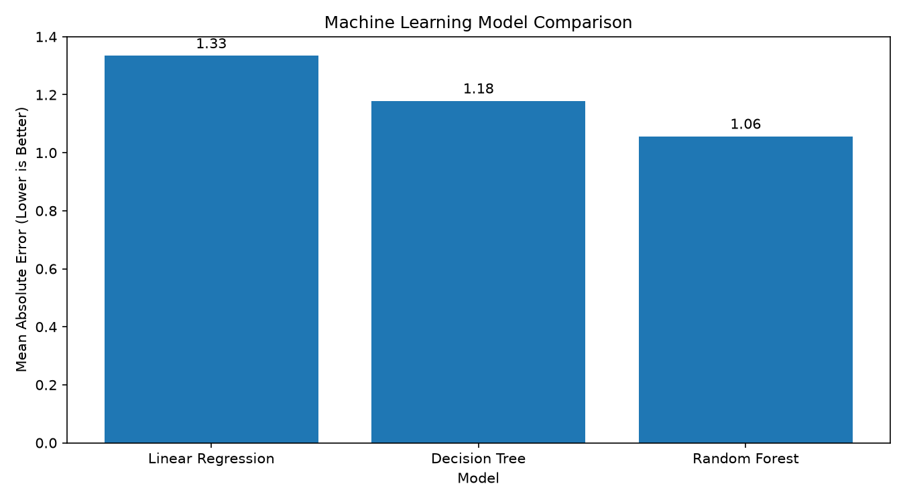

# Student Performance Prediction

A machine learning project that predicts a student's final academic grade using student performance data.

## Project Overview

This project uses the UCI Student Performance dataset containing information about 395 students.

A Linear Regression model is trained to predict the final grade (G3) using:

- Age
- Study time
- Previous failures
- Number of absences
- First period grade (G1)
- Second period grade (G2)

## Technologies Used

- Python
- Pandas
- NumPy
- Scikit-learn
- Matplotlib
- Seaborn
- Git & GitHub

## Project Structure

```text
student-performance-prediction/
│
├── dataset/
│   ├── student_data.csv
│   └── student-mat.csv
│
├── train_model.py
├── visualize.py
├── predict.py
├── README.md
├── requirements.txt
└── .gitignore


## Machine Learning Model Comparison

Three machine learning algorithms were evaluated using the same training and testing data.

| Model | MAE | MSE | R² Score |
|---|---:|---:|---:|
| Linear Regression | 1.33 | 4.46 | 0.78 |
| Decision Tree | 1.18 | 4.25 | 0.79 |
| Random Forest | 1.06 | 2.92 | 0.86 |

**Best Model: Random Forest**

Random Forest achieved the lowest MAE (1.06) and highest R² score (0.86) among the three tested models.

### Model Comparison Graph




